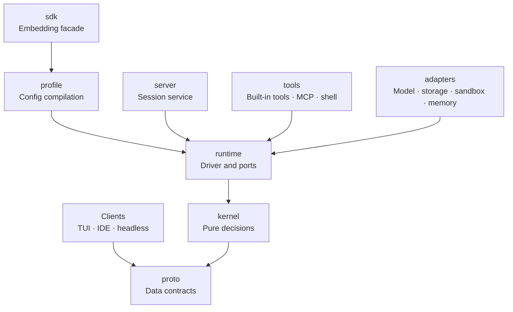
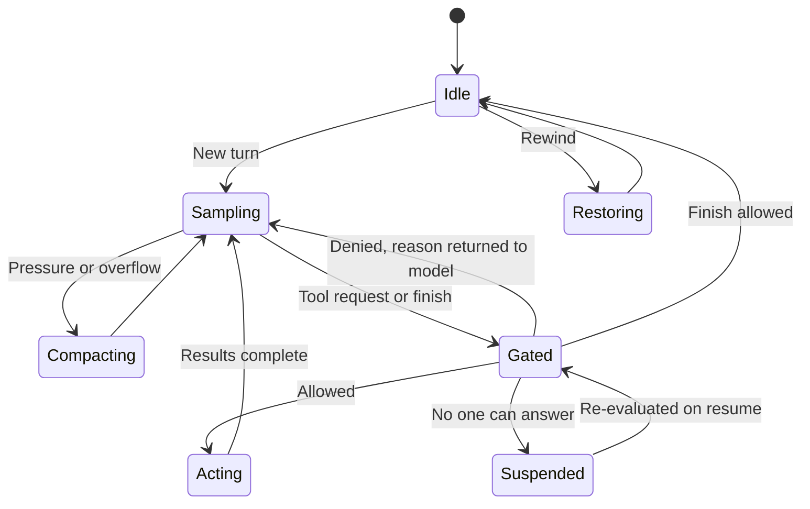

# Rust Agent Framework — Architecture Design v2

## Overview

This framework builds coding agents in Rust (modeled on Claude Code): the model calls tools in a loop to read and write the workspace and run commands, asking a human for approval when necessary. All state derives from a single append-only event log, and every decision is made by a pure kernel that performs no IO.

| Goal | Verifiable criterion |
| --- | --- |
| Recoverable | After a crash at any Effect boundary, the log and the workspace are identical to a fault-free run |
| Replayable | Any model request can be rebuilt byte-for-byte from the log |
| Testable | No state transition depends on an async runtime; every one can be reproduced with a fixed seed in deterministic simulation |
| Cache-stable | Within one request sequence, between two replacements, every request is a byte-for-byte prefix extension of the previous one |
| Injection-contained | Without a real human's approval, prompt injection cannot exfiltrate private data or write to persistence locations |
| Vendor-neutral | Adding a model vendor requires no kernel code changes |

Non-goals for v1: native Windows execution (run via WSL2), multiple sessions writing the same workspace concurrently (parallel writers use separate worktrees), and sessions distributed across machines.

### Design principles

- **The log is the truth**: runtime state, model context, UI, and checkpoints are all projections of the log.
- **The kernel is a pure function**: decisions perform no IO, read no clock, and run no user code.
- **Declaration is authorization**: a tool first declares the resources it will access, and that one declaration drives scheduling, authorization, sandboxing, and rollback.
- **One gate, tighten only**: every extension that can change execution passes through the same Gate chain, and each ring can only make the result stricter.
- **Rendering sees only itself**: an event is rendered once at write time and persisted with the event, so the context is append-only.
- **Trust travels with data**: every event carries a trust annotation; taint is derived from it and propagates through summaries, sub-agents, and memory.
- **Classification only reduces approvals; enforcement is the boundary**: command classification and auto rules exist only to ask less; overreach is blocked by the sandbox, enforced according to declarations.

### Terminology

| Term | Meaning |
| --- | --- |
| Journal | The session's append-only event tree; the single source of truth |
| Event | A fact that has happened, immutable once written; model-visible events also store their rendered result |
| Blob | Content-addressed bulk data; events store only references |
| Signal / control | A signal enters the context (user messages, notifications); a control only changes execution (interrupt, rewind) |
| Effect | Something the kernel asks the outside world to do: sample, execute tools, request a verdict, take a snapshot |
| Driver | The loop in the runtime: dispatches Effects and feeds their results back to the kernel as inputs |
| Safe point | A moment when new input may be inserted: after a reply ends, or after a batch of tool results is complete |
| Replacement | An event that swaps a stretch of history for shorter content; the only way to remove content from the context |
| Request sequence | A series of requests with a fixed head followed only by appends; switching sequences invalidates the cache |
| Gate / observer | A Gate can allow, deny, rewrite, inject, or ask; an observer only subscribes and does not affect execution |
| Access | A tool call's read/write declaration over resources |
| Profile | The immutable result compiled from all configuration layers |
| Taint | A marker that the context contains untrusted content, derived from events' trust annotations |
| Pulse | A transient stream of token deltas, progress, and heartbeats; never persisted |

## Architecture

The framework uses a hexagonal architecture: data contracts and pure decisions sit at the center, all IO sits in the outer ring, and dependencies point only inward.



Arrows mean "depends on". Clients depend only on the JSON Schema exported by `proto` and never link the kernel.

| Crate | Responsibility | IO |
| --- | --- | --- |
| `proto` | Events, signals, Effects, verdicts, resource URIs, protocol messages; data and serde only | None |
| `kernel` | State machine, scheduling, built-in gating, taint derivation, rendering | None |
| `runtime` | Driver, port traits, task registry, snapshots, observer dispatch | Yes |
| `profile` | Discovers and merges configuration, compiles it into a `Profile` | Read-only files |
| `adapters/*` | Models and encoders, Journal and Blob storage, OS sandbox, memory storage | Yes |
| `tools` | Built-in tools, MCP client, shell parsing and semantic table | Yes |
| `macros` | `#[tool]`, `#[agent::test]` | None |
| `server` | Session service, multi-client fan-out | Yes |
| `sdk` | Application-facing facade, re-exports common types | Yes |
| `sim` | Virtual clock, scripted model, controllable scheduling, fault injection | None |

Boundaries are enforced by CI: if tokio, reqwest, or filesystem calls appear in `kernel`'s dependency tree, or its public API accepts closures, the build fails. The kernel uses only ordered containers and must not depend on hash iteration order, guaranteeing that the same input always yields the same output.

## Execution model

A turn starts from one input and loops between "sample" and "execute tools" until the model finishes and the Stop hook allows it. The kernel decides what to do and the driver does it; the two interact only through inputs and Effects.



While waiting for a Hook or human verdict, execution stays in `Gated`; when unattended and facing an approval that no one can answer, it enters `Suspended`. A hard interrupt can return to `Idle` from any phase.

### Kernel and driver

`decide` turns inputs into events and Effects, and `evolve` folds events into state; both are pure functions.

```rust
pub trait Decider {
    type State: Default;
    fn decide(s: &Self::State, at: Timestamp, input: Input) -> Result<Decision, Rejection>;
    fn evolve(s: &mut Self::State, ev: &Envelope<Event>);
    fn outstanding(s: &Self::State) -> Vec<(EffectId, Effect)>; // Issued but not completed: reconciled on recovery
}

pub struct Decision { pub events: Vec<Event>, pub effects: Vec<(EffectId, Effect)> }

pub enum Input {
    Signal(Signal),               // Enters the context
    Control(Control),             // Only changes execution
    Streamed(EffectId, ToolCall), // Mid-sampling, one tool call block is complete
    Completed(EffectId, Outcome), // An Effect's result, including actual token usage
}

pub enum Effect {
    Sample(Prompt), Execute(Batch), Gate(GateRequest), Compact(Job),
    Checkpoint(Scope), Restore(RestorePlan), Finish(Outcome),
}
```

The driver strictly follows "persist first, execute second": the events produced by `decide`, including "Effect issued", are written to the log before the Effect is dispatched. Model replies, tool results, human answers, and timestamps each enter exactly once, as inputs; replay only re-runs `evolve` and calls no external service.

### Inputs and controls

| Signal | Source | Takes effect | Behavior |
| --- | --- | --- | --- |
| Steer | User | Next safe point | Does not interrupt current work; finishing is not allowed until it is delivered |
| Queue | User | Next turn | Starts a new turn after returning to Idle |
| Notification | System, task, Hook | Next safe point | Delivered as a data block annotated with its source; notifications of the same kind are merged in the mailbox |
| Wake | System, task, Hook | Next turn | Starts a new turn when idle, consuming continuation budget |
| Silent | System | Immediately | Updates state only; if something changed, appends a snapshot at the next safe point |

| Control | Semantics |
| --- | --- |
| Soft interrupt | Stops after the current tool finishes |
| Hard interrupt | Cancels immediately; the partially displayed reply is written to history and marked "interrupted", missing tool results are filled in as "cancelled before execution", so the next request matches what the user saw |
| Pause / resume | Stops dispatching new Effects; in-flight calls complete naturally |
| Answer | Responds to a pending approval |
| Rewind | Returns to a specified event and produces a workspace rollback plan |
| Switch model | Starts a new request sequence (see "Context") |

### Execution rules

- **Batches are judged before execution**: a read-only call may pass gating and start as soon as its own call block is complete; calls with side effects wait until the reply ends and the whole batch's verdicts are settled.
- **Denials have results too**: a denied call returns a tool result as usual, whose content is the denial reason.
- **Stale results are harmless**: an `EffectId` carries a lease generation and an interrupt generation; each interrupt increments the interrupt generation, and late results from earlier generations are silently discarded.
- **Continuations are bounded**: all continuations not initiated by the user share one counter, which resets on user input.

## Journal

The Journal is an append-only event tree: runtime state, model context, UI, audit, and checkpoints are all projections of it and can be rebuilt at any time.

```rust
pub struct Envelope<E> {
    id: EventId,                // ULID
    parent: Option<EventId>,    // Edits, rewinds, and forks are all new events whose parent is an old node
    seq: u64,                   // Monotonic sequence number within the session; also the subscription cursor
    at: Timestamp,              // Injected by the driver; the kernel's only source of time
    origin: Origin,             // Who produced it: user, system, a specific Hook, tool, plugin, or model
    trust: Trust,               // How to treat it: user input, trusted guidance, untrusted data (with source label)
    audience: Audience,         // Model | User | Both
    schema: u16,                // Upgraded step by step on read; old data is never migrated
    body: E,                    // Bulk content is referenced as a Blob
    rendered: Option<Rendered>, // Rendered result of a model-visible event, produced at write time
}
```

- **Single writer**: the driver holds a session lease with a generation and checks the expected sequence number on append; once the lease changes hands, the old driver's writes and Effects are rejected because its generation is stale.
- **Blobs share the port**: long output, attachments, and original file contents are stored as content-addressed Blobs, managed by the same storage port as events; the Blob is written before the event, and garbage is collected by reachability.
- **Snapshots are only a cache**: the folded state is saved periodically; loading = latest snapshot + the events after it; snapshots can be deleted at any time.
- **Transient data stays out of the log**: token streams, progress, and heartbeats go through Pulse.
- **Unknown events**: plugin events can be marked "ignorable"; if an unknown, unmarked event is encountered on read, loading the session is refused rather than silently dropping it.
- **Deletion**: a tombstone keeps the tree structure and erases the body; summaries and memories derived from it are purged in cascade.

| Read model | Purpose | Updated |
| --- | --- | --- |
| Kernel state | Basis for decisions, including authorization and taint | Every event |
| Model context | The next request | Appended at every safe point |
| UI view | Messages, tasks, pending approvals | Pushed incrementally to subscribers |
| Audit | Queryable record of events and verdicts | Asynchronously |
| Checkpoints | Rewindable workspace versions and change attribution | Every safe point |

## Context

The model context is a projection of the Journal and is append-only within a request sequence: history is never silently rewritten, and content can only be removed through explicit replacement events.

| Layer | Contents | Source | When it changes |
| --- | --- | --- | --- |
| Static | System prompt, tool definitions, trusted project instructions, skills catalog | Profile | When a new request sequence starts |
| Durable | Compaction summaries, long-term memory | Replacement and memory-load events | On compaction, at session start |
| Transcript | Conversation, tool calls and results, injections, state snapshots | Events on the current branch | Appended at every safe point |

### Request sequence

Request sequence = fixed head (Static layer, render profile, encoder version) + append-only event renderings. The sequence head is logged as an event; the cache is invalidated only when a new sequence starts or a replacement event occurs, and both are counted in metrics.

| Change | Model supports mid-sequence updates | Model does not |
| --- | --- | --- |
| System prompt change | Appended as a system message; sequence unchanged | Start a new sequence at the next idle point |
| Tools added or removed | Append an add/remove notice; new tools are loaded lazily first | Start a new sequence at the next idle point |
| Model switch | Start a new sequence and re-render history with the new model's render profile | Same as left |

The cache is already isolated per model, so switching models necessarily bills from scratch; re-rendering history in the new format therefore adds no cost. The re-rendered result is stored in the log as an event, so requests can still be rebuilt from the log.

### Write-time rendering

```rust
/// Called once when an event is written; the result is persisted with the event and projected verbatim afterward
pub fn render(rules: &RuleSet, profile: &RenderProfile, ev: &Event) -> Rendered;

/// Encodes the sequence head and rendered results into a wire request; the version is recorded in the sequence head and frozen after release
pub trait Encoder {
    fn version(&self) -> u32;
    fn encode(&self, head: &SeqHead, body: &[Rendered]) -> Request;
}
```

- **History cannot be rewritten**: `render` sees only this one event, not other events or current state.
- **Rule changes affect only new events**: old history stays as it is, which is exactly what the cache needs.
- **Whole-request decisions belong to the encoder**: cross-event decisions such as field order and cache breakpoint placement are made by the encoder. Encoders are versioned and frozen after release, and new versions are used only for new sequences, so a request is a pure function of the sequence head, the rendered results, and the encoder version, and can still be rebuilt byte-for-byte after framework upgrades.
- **Global operations live elsewhere**: notifications are merged before entering the log; injection quotas are enforced at write time, with the excess stored as a Blob; removal happens only through replacement events.

### State snapshots

"What is it now" information such as the current mode, environment, and time is compared against the rendered result at safe points, and a snapshot is appended only when it changes; when cleared, a "previous snapshot is void" is appended. Each rule can be rate-limited, e.g. time at most once every 10 minutes. Old snapshots are marked "supersedable" and are the first to be dropped during pressure relief.

### Trust and presentation

No component may write text directly into the prompt; it can only produce events. Presentation is determined by the event's trust annotation, and the concrete format is supplied by the render profile for the target model.

| Trust | Presentation | Examples |
| --- | --- | --- |
| User input | Presented verbatim | User messages, `@file` attachments |
| Trusted guidance | Through the instruction channel the model was trained on, such as a mid-sequence system message or system-reminder | Framework reminders, instruction files in trusted workspaces, Hooks in trusted configuration, long-term memory |
| Untrusted data | Wrapped in a data frame with a fixed warning stating that instructions inside must not be followed | Web pages, MCP results, other sessions, content from untrusted workspaces |

Trusted guidance is not wrapped in a data frame: the model might treat it as third-party content and not follow it.

### Pressure relief

When the context is tight, it is handled level by level from cheapest to most expensive; each of the last three levels is a replacement event, and the original text remains in the log.

| Level | When | Method | Calls model |
| --- | --- | --- | --- |
| 1. Spill to disk | At write time | Oversized output is stored as a Blob; the model sees only a head/tail preview and a reference | No |
| 2. Trimming | Pressure | Old tool results keep head and tail, with the middle trimmed; superseded snapshots and catalogs are dropped | No |
| 3. Image offload | Pressure | Old images are replaced with attachment paths | No |
| 4. Summarization | First three levels still insufficient | The earliest stretch is replaced with a summary, keeping the most recent portion verbatim | Yes |

- **Two triggers**: usage = actual usage of the last request + an estimate of content added since; exceeding 80% of the window (while reserving enough room for output) is pressure. A request rejected as too long is overflow, and it is retried only if history actually got shorter.
- **Boundaries**: replacement works in groups, never separating a tool call from its result, but it may fall inside an overlong turn.
- **Summaries reuse the cache**: on the pressure path, the summary call replays the current request verbatim and appends only a summary instruction at the end, so the only new input is that instruction.
- **Overflow degradation**: on the overflow path, a replay would necessarily be too long again, so levels 2 and 3 are forced first, then only the earliest stretch is summarized on its own, advancing stretch by stretch until it fits.
- **Fixed summary structure**: user intent, key concepts, files and code, errors and fixes, to-dos, current work, next steps, decisions and constraints; paths, commands, error messages, identifiers, and numeric values are preserved verbatim, and user corrections are recorded faithfully. When presented, a fixed note is attached: this is an automatic checkpoint; continue working with it as established background, without restating or responding to it.
- **Only one summary**: if a summary already exists, merge with it, keeping what still holds and dropping what is outdated.
- **Summaries inherit taint**: a replacement event records the replaced range and source events; all untrusted labels of the covered content transfer to the summary, and gating judges accordingly.

### Other conventions

- **Subdirectory instructions are injected on access**: at startup, only the instruction files from the project root to the working directory are loaded; when a tool first accesses a subdirectory, the not-yet-injected instructions along that directory chain are appended, and updates are appended when files change. The total is bounded by a byte budget; when exceeded, broader ones are omitted first, then the most specific are truncated. If cleared by compaction, they are re-injected at the next step.
- **Visibility is separate from executability**: modes such as plan mode are communicated to the model via snapshots; tool definitions stay unchanged, and gating denies write operations at runtime.
- **Skills load progressively**: the Static layer holds only the catalog; when the model calls `load_skill`, the body enters the Transcript as a tool result.
- **Document the model experience**: every tool's and plugin's documentation has a "Model experience" section stating what the model sees, the token cost, and the cache impact, verified by golden snapshots in CI.

## Model port

The unified interface carries only semantics shared across vendors, and private data is passed through verbatim; switching models is a kernel decision and never happens silently inside the port.

```rust
pub trait ModelPort: Send + Sync {
    fn caps(&self) -> &ModelCaps;
    fn encoder(&self) -> &dyn Encoder;
    fn stream(&self, req: Request) -> BoxStream<'_, Result<Delta, ModelError>>;
}

let model = Claude::default()
    .retry(3)       // Exponential backoff within the same model, honoring retry_after
    .rate_limit(q)  // Quota shared across sessions
    .meter();       // Records usage and cost
```

- **Layers act only on the same model**: retry, rate limiting, and metering stack as Layers; retries go only into metrics, not into the log.
- **Switching is decided by the kernel**: the fallback model chain is written in the Profile. After the port reports unavailability, the kernel writes a switch event and starts a new sequence; a manual user switch takes the same path.
- **Decide by capability**: `ModelCaps` describes parallel tools, thinking, images, structured output, window size, cache breakpoint limits, mid-sequence update capability, render profile, and token estimator; the kernel only queries capabilities and never checks the vendor.
- **Streaming assembly**: the runtime assembles deltas into a reply for the kernel, delivering each complete tool call block early as `Streamed`; deltas are also pushed to clients as Pulse.
- **Private data passthrough**: vendor-private content such as thinking signatures is stored verbatim and sent back verbatim; it is discarded with the new sequence when switching models.
- **Error normalization**: stop reasons and errors are unified into enums distinguishing retryable errors; too-long maps to overflow and is handed to pressure relief.
- **Conformance tests**: all adapters pass the same set of recorded fixtures, verifying consistent semantic mapping and deterministic encoding.

## Tools and resources

A tool declares the resources it will access before execution, and the runtime hands it handles to only those resources; the declaration is written in the parameter types.

```rust
/// Replaces the single occurrence of old in the file with new
#[tool]
async fn edit(file: Write<File>, old: String, new: String) -> Result<()> {
    file.replace_once(&old, &new).await
}
```

To the model, `Write<File>` is a path in the JSON Schema; to the framework, it is a write declaration; to the function body, it is a handle that can write only this file. Built-in capability types are `Read<File>`, `Write<File>`, `Read<Dir>`, `Get<Url>`, `Net<Url>`, `Exec<Cmd>`, `Secret<Name>`, and `Mem<Key>`; tools whose access scope is known only at runtime (bash, MCP) implement the `Tool` trait by hand and return the declaration from `access()`.

Resources are uniformly represented as URIs: `fs:///repo/src/**`, `net:api.github.com:443`, `cmd:cargo test*`, `mcp:github/create_issue`, `secret:GITHUB_TOKEN`, `mem:project/conventions`, `git:refs`.

### One declaration, many uses

| Use | Method |
| --- | --- |
| Scheduling | Builds a conflict graph from resource read/write locks: parallel when conflict-free, serial on conflict |
| Authorization | Policies match resource URIs to allow, deny, or ask |
| Sandbox | Compiled into an OS sandbox configuration, with writable paths and reachable domains mapped one-to-one |
| Staleness detection | Records the hash of content read and verifies it before writing; if stale, an error is reported to the model |
| Rollback | Declared writes save the original before execution and are recorded in change attribution |
| Taint | Automatically annotated when reading untrusted sources or private resources |

### Side-effect classes

| Class | Examples | After a crash |
| --- | --- | --- |
| Pure | Reading files, searching, GET requests | Re-run directly |
| LocalWrite | Editing files, writing memory | Restore originals, then re-run |
| Network | POST requests | Ask the user |
| Irreversible | Sending email, `git push` | Ask the user; on rewind, only listed, never pretended to be undone |
| Opaque | Shell commands that cannot be analyzed | Ask the user |

Tools with no write, network, or exec parameters are automatically classified as Pure.

### Shell commands

Shell parsing is used only to reduce approvals; the security boundary is the sandbox enforcing declarations. When no sandbox is available (platform unsupported or not yet implemented), the semantic table has no effect and bash is always treated as Opaque.

- **Splitting**: pipes, `&&`, `;`, and subshells are split into simple commands, each becoming a `cmd:` resource, so policies can authorize by prefix.
- **Semantic table**: common commands map to concrete access, e.g. `rg` and `git diff` are read-only, `git commit` writes the repository, `curl` accesses the network; the table can be extended in configuration. Commands classified as read-only run in a read-only, network-disconnected sandbox, so even if repository configuration makes git execute code, it can neither write nor send anything out.
- **Authorization bound to definitions**: for commands whose behavior is defined by files (`npm run`, `make`, cargo aliases, etc.), authorization is bound to the content hash of the defining file; if the model edits the scripts in `package.json`, authorization for `cmd:npm run test*` is immediately invalidated and must be asked again.
- **Fallback**: unknown commands, variable expansion, and command substitution are always classified as Opaque; Opaque takes the whole workspace exclusively and is serialized with other write operations.

### Other conventions

- **Path safety**: handles are opened relative to the workspace root (Linux uses `openat2` + `RESOLVE_BENEATH`, macOS uses step-by-step `openat` + `O_NOFOLLOW`), so symlinks cannot carry access outside the workspace.
- **Background tasks**: long-running commands, asynchronous sub-agents, and timers are managed by the task registry; they can be listed, terminated, and given timeouts, and their output is stored as Blobs.
- **Two kinds of errors**: tool failures are returned to the model as results; only infrastructure errors propagate upward.

## Gating

There is only one path for extensions that can change execution: the Gate chain. Five rings are evaluated in order, and each ring can only make the result stricter; extensions that only notify or integrate are observers and never affect execution.

| Order | Ring | Runs in | Examples |
| --- | --- | --- | --- |
| 1 | Invariant | Built into the kernel, cannot be disabled | Exfiltration, persistence, self-modification, unknown effects (see "Security") |
| 2 | Policy | Kernel, rules from the Profile | Allow, deny, or ask by resource URI |
| 3 | Budget | Kernel | Tokens, money, duration, call count, repeated calls |
| 4 | Hook | Executors in the runtime | Team conventions, format checks, injected reminders |
| 5 | Human | Auto-answer rules, then the client | Approve, approve with edited arguments, deny with a reason |

```rust
pub enum Verdict {
    Allow,
    Deny(Reason),       // Reason is returned to the model as the tool result
    Rewrite(Proposal),  // Rewrite arguments or results
    Annotate(Context),  // Inject context, with source annotated automatically
    Ask(Question),      // Hand off to a human
    Continue(Reason),   // Stop hook only: require the model to continue
    Defer,              // Suspend the session; re-evaluate on resume
}
```

- **Tighten only**: a denial in any ring ends evaluation; a later ring may upgrade an allow to an ask, but cannot turn a deny or ask back into an allow.
- **Rewrites are re-checked**: a rewritten proposal is re-checked from ring 1, and the rewriter does not process it again; a rewrite depth above 3 is denied, guaranteeing termination.
- **Rewrites do not launder**: a rewritten result keeps the original result's trust annotation, so a Hook cannot use rewriting to turn untrusted content into trusted guidance.
- **Verdicts are logged**: every verdict is recorded together with its answerer; replay reads it directly without re-running Hooks.
- **No user code in the kernel**: the first three rings read only configuration data; user logic (including closures registered in code) runs only in rings 4 and 5, in the runtime.

### Approval levels

Asks are divided into two levels by the ring that produced them; the level is annotated by the framework and cannot be self-reported by a Gate.

| Level | Who can answer in interactive mode | When unattended |
| --- | --- | --- |
| Policy-level (rings 2-4) | Auto-answer rules, then a real human | Auto-answer rules, then allow, deny, or suspend per configuration |
| Invariant-level (ring 1) | Real human only | Allowed in a disposable environment, otherwise suspended |

Only disposable environments launched by the framework itself are recognized: when the sandbox adapter creates one, it knows the workspace is a copy, the network reaches only the allowlist, and there are no extra secrets. When the framework runs in an external container, the environment's self-report does not count; an attestation issued by the orchestration system is required.

### Hooks

| Hook | Available verdicts (besides allow) | On execution failure |
| --- | --- | --- |
| SessionStart | Inject | Allow |
| UserSubmit | Deny, rewrite, inject | Allow |
| PreSample | Deny, ask | Block |
| PreTool | Deny, rewrite arguments, ask, suspend | Block |
| Permission | Deny, rewrite arguments, suspend | Hand off to a human |
| PostTool | Rewrite result, inject | Allow |
| PreCompact | Inject points to preserve | Allow |
| Stop | Inject, require continuation | Allow |

### Observers

An observer is an event stream subscriber with its own cursor, delivered at least once by the runtime with the event id as idempotency key. Its failures are only logged, and when slow it merely falls behind; it never blocks the main loop. When it needs to give feedback, it can only deliver a signal.

Hooks and observers share the same set of executors: external commands (stdin/stdout JSON), HTTP, MCP tools, and in-process closures. Hooks may additionally use a model call or a sub-agent to make a judgment, consuming budget.

## Security

Four layers of defense are independent of each other; failure of any single layer does not directly lead to overreach.

| Layer | Mechanism | Primarily guards against |
| --- | --- | --- |
| Declaration | Capability types and handles | Out-of-bounds access caused by defects in the tool itself |
| Gating | Invariants, policies, human approval | Model overreach, operations induced by prompt injection |
| Sandbox | OS sandbox compiled from declarations | Opaque commands, compromised tools and subprocesses |
| Egress | Network proxy + domain allowlist | Data exfiltration |

### Workspace trust

Repository content is the largest injection source for a coding agent, so trusting a workspace is an explicit decision, merged into the same prompt as the first-time confirmation of project configuration.

| Content | Trusted workspace | Untrusted workspace |
| --- | --- | --- |
| Instruction files | Trusted guidance, enters the Static layer | Untrusted data |
| Hooks, MCP, and commands in project configuration | Active | Inactive |
| Workspace files | Produce no taint | Untrusted content |
| Ignored paths (`node_modules`, vendor, etc.) | Untrusted content by default, can be allowed via configuration | Untrusted content |

When reviewing external contributions (such as someone else's PR branch), open them in untrusted mode.

### Taint

The harm of prompt injection comes from three things happening together: untrusted content in the context, contact with private data, and the ability to send data out. The framework derives these states automatically from events' trust annotations, with no cooperation needed from tools.

| Category | Includes by default |
| --- | --- |
| Untrusted content | Network reads, MCP results not marked trusted, files outside the workspace, content from untrusted workspaces, ignored paths |
| Private data | Secrets, files under the home directory outside the workspace, `.env*`, resources marked private |
| Exfiltration egress | Network access outside the allowlist, networked Opaque commands |
| Persistence targets | Long-term memory, shell startup files, scheduled-task configuration, `.git/hooks`, `.git/config` |

- **Derived, not stored**: taint is a projection in kernel state, derived from events' trust annotations, recording which events introduced it. Granularity and rules can evolve by simply re-folding the log, without changing `proto`.
- **Only grows within a session**: once untrusted content enters the model context, the taint remains until the session ends, and propagates through summaries, sub-agent inputs and outputs, and memory writes; it can only be removed by starting a new session or by the user explicitly clearing it after review, and the clearing itself is an event.
- **Trusted sources**: specific sources (such as an internal documentation site) can be marked trusted, so reading them produces no taint; this field is sensitive configuration and cannot be set at the project layer.

### Invariant rules

| Rule | Trigger condition |
| --- | --- |
| Exfiltration | Tainted, has read private data, and wants to access an exfiltration egress |
| Persistence | Tainted, and wants to write a persistence target |
| Self-modification | Writes the framework's own configuration, Hooks, or plugin directories (regardless of taint) |
| Unknown effect | Opaque command not executed in isolation |

When triggered, the ask is always upgraded to invariant-level approval, and auto-answer rules have no authority to allow it.

### Controlling approval count

The judgments are conservative; with too many approvals, users habitually click "Allow" and the defense becomes meaningless.

- **Authorize by destination**: when approving an exfiltration ask, the user can choose "allow sending to this domain for this session".
- **Keep the allowlist narrow**: include only destinations that do not expose request contents to third parties, such as internal services and package registry mirrors.
- **Isolated reads**: untrusted content such as web pages is handed to a sub-agent without private permissions, which returns only results of closed types such as enums and numbers; those results carry no taint.
- **Continuous measurement**: approval counts and approval rates are tracked per rule, and rules with approval rates near 100% are flagged for adjustment.

### Sandbox and platforms

The sandbox adapter probes platform capabilities at startup, selects an implementation per the table below, and reports the result in `agent doctor`.

| Platform | Preferred | Fallback | Isolated execution |
| --- | --- | --- | --- |
| Linux | bubblewrap | landlock + seccomp | overlayfs |
| macOS | seatbelt | None | Unsupported; Opaque requires approval first |

bubblewrap and overlayfs rely on unprivileged user namespaces, which some distributions (such as recent Ubuntu) restrict by default; if probing fails, the adapter falls back. Fallback mode cannot restrict the network to the egress proxy, so the sandbox is always network-disconnected, and commands that need the network require approval first.

### Other

- **Secrets**: injected into tools as handles and never enter the context; uniformly redacted before being written to the log, Blobs, or traces.
- **Sensitive configuration can only tighten**: auto-answer rules, unattended mode, the egress allowlist, and trusted sources are accepted only from the managed, command-line, and user layers; the project layer can only tighten them, so configuration inside a repository cannot loosen its own approvals.
- **The log is not sent out**: session logs stay local by default and are not sent to model vendors with requests; the user can explicitly enable this when needed.

## Checkpoints and recovery

A conversation can be rewound to any step, the workspace is restored accordingly, and only changes made by the agent are undone; if the process crashes at any moment, the session can continue. Both are built on the Journal and shadow snapshots.

### Snapshots

- **Shadow repository**: the runtime maintains a content-addressed snapshot store outside the workspace, fully separate from the user's `.git`.
- **Timing**: one snapshot at every safe point and one before executing each batch of calls that includes writes, recorded as checkpoint events.
- **Change detection**: filesystem events (inotify, FSEvents) are preferred, falling back to scanning by modification time and size; only changed files are hashed, so cost is proportional to the amount changed, though the first run requires a full scan.
- **Exact originals**: declared writes save the original directly before execution, without relying on scanning.

| Path | Snapshot method | On rewind |
| --- | --- | --- |
| Inside the workspace, not ignored | Content saved | Agent changes restored |
| Ignored by `.gitignore` | Only path and metadata recorded | Not restored; changes listed |
| `.git` | Not snapshotted | Ref changes handled separately |
| Outside the workspace | Writes forbidden by the sandbox | Nothing to handle |

### Change attribution

Each checkpoint also records who made each change, and rewinding undoes only changes attributed to the agent.

| Change source | Identification |
| --- | --- |
| Declared writes | The tool's write declaration and saved original |
| Opaque commands | With isolated execution, the overlay's change list; otherwise the diff between snapshots before and after execution |
| Background tasks | Changes within the task's declared scope during its lifetime |
| Others (user, IDE, external processes) | Attributed as external changes; untouched on rewind |

While a non-isolated Opaque command is running, external changes to the same files cannot be distinguished and are attributed to the agent.

### Rewind

- **Stop background writes**: background tasks with write access to the workspace are terminated or paused first.
- **Per-file comparison**: only changes attributed to the agent are processed; a file is restored only if its current content matches the version the agent last wrote, otherwise it is listed as a conflict.
- **Execute by plan**: the rollback plan is written to the log first, then files are written one by one; if a crash occurs midway, the same plan is redone after recovery.
- **Report**: lists conflicting files, ignored paths not restored, irreversible operations, and git ref changes.

git commands that rewrite refs record the before and after values of HEAD and branches; restoring refs is a separately confirmed optional step, and `git push` is only listed, never undone.

### Isolated execution (Linux)

Opaque commands that do not use the network can run inside overlayfs: afterward there is an exact change list; if everything is within the allowed scope it is merged automatically, otherwise the diff is handed to a human for approval. This turns "approve then execute" into "execute then approve", significantly reducing the number of approvals. Commands in isolated execution cannot be turned into background tasks; on timeout they are terminated and their changes discarded.

### Crash recovery

On recovery, the snapshot is loaded, subsequent events are folded, and then every "issued but not completed" Effect is reconciled one by one.

| Effect | Handling |
| --- | --- |
| Sampling, compaction, snapshot, rewind | Re-executed per the original plan |
| Tool call | By side-effect class: Pure is re-run directly, LocalWrite restores originals and re-runs, others ask the user; suspended when unattended |
| Sub-agent | Resumes the same child session, which goes through its own recovery flow |
| Pending verdict | Re-issued |

## Configuration and extensions

Everything configurable is first discovered, then merged by layer, and finally compiled into one immutable `Profile`. Compilation is a pure function whose result hash is logged, so the same set of sources always yields the same Profile.

| Priority | Source | Location |
| --- | --- | --- |
| 1 | Managed policy | System directory distributed by administrators; can lock fields |
| 2 | Command line | Arguments for this run |
| 3 | Local project | `.agent/settings.local.toml`, not checked into version control |
| 4 | Shared project | `.agent/settings.toml`, distributed with the repository |
| 5 | User | `~/.agent/settings.toml` |

- **Ordinary fields**: higher priority overrides lower priority.
- **Permission rules**: merged across layers; a denial in any layer takes effect.
- **Sensitive fields**: accepted only from the managed, command-line, and user layers; the project layer can only tighten them (see "Security").
- **Hot reload**: configuration changes are recompiled at the next idle point and never change tool definitions mid-turn; `agent config explain <key>` shows which layer an item's final value came from.

| Component | Form | Compiles to |
| --- | --- | --- |
| Instruction files | `AGENTS.md` and the like, searched upward from the working directory | In trusted workspaces, the Static layer; those in subdirectories are injected on access |
| Skills | Directory of instructions + optional scripts | Catalog in Static, body loaded on demand |
| Commands | Markdown templates or local actions | Slash command table |
| Sub-agents | Definition files with frontmatter | Child Profile, registered as a tool |
| Hooks | Hook point + match condition + executor | Gate or observer |
| MCP | Server list and connection parameters | Tools + stateful connections |
| Plugins | Versioned bundle of any combination of the above | Expanded and merged the same way |

### Sub-agents

A sub-agent is an independent session with its own Journal and recovery flow; the parent session records only its start and end. The child session id is derived from the call in the parent session, so recovery always finds the same one.

Its permissions can only be narrower than the parent's: tools are intersected, resource scopes fall within the parent's authorization, budget is carved out of the parent's, approval mode and execution mode are inherited from the parent, and taint propagates in both directions through inputs and outputs. It can be called synchronously, run in the background, or run in parallel, and clients can subscribe to its event stream separately.

| Mode | Starting point | Cache | Suited for |
| --- | --- | --- | --- |
| New | Blank session; the task description must be self-contained | Billed from scratch | Independent subtasks |
| fork | Seeded with the parent session's completed turns | Reuses the inherited prefix | Subtasks that continue the current conversation |

On fork, differences in prompt and tools between the sub-agent and the parent are appended as mid-sequence updates without rewriting inherited history, and taint is inherited wholesale; if the model does not support mid-sequence updates, it falls back to a new sequence.

### Long-term memory

Cross-session memory uses a separate storage port, but every read and write is recorded in the Journal, and replay does not access the memory store.

| Operation | When | How it enters the context |
| --- | --- | --- |
| Load | Session start | Durable layer |
| Retrieve | Model calls `recall` | Tool result |
| Write | Model calls `remember` | Tool result; enters the Durable layer in the next session |

A memory write is an ordinary `mem:` resource write: the original is saved, it can be rewound, and it is subject to gating. Memory is also a persistence target, so writing memory from a tainted context requires real human approval, preventing a single injection from contaminating all future sessions.

## Interfaces

The framework runs as a service, and terminals, IDEs, and scripts are all clients; Rust programs embed it in-process via `sdk` using the same protocol, behaving identically to remote clients.

| Channel | Contents | Reliability | Reconnection |
| --- | --- | --- | --- |
| Event stream | User-facing Journal events | Ordered, lossless | Replays from a specified sequence number, then switches to live |
| Pulse stream | Token deltas, progress, heartbeats | Bounded buffer, lossy | Not replayed; the view is rebuilt from the event stream |
| Commands | Signals, control instructions | Carry idempotency keys, safe to retry | Not applicable |

- **Multiple clients**: several clients can connect simultaneously; approval is compare-and-swap, the first answer wins, and the other clients close their dialogs in sync.
- **headless**: a client that prints the event stream as JSON Lines, for CI; on a pending approval it exits with an agreed exit code, and `--resume` continues later.
- **Swappable transport**: stdio, WebSocket, in-process channels; all message types come from `proto`, and versions are negotiated on connection.

### Assembly and running

```rust
use agent::prelude::*;

#[tool]
async fn read(file: Read<File>) -> Result<String> { file.text().await }

let agent = Agent::new(Claude::default().retry(3))
    .tools((read, edit, Bash))
    .policy("agent.toml")
    .journal(Sqlite("runs.db"))
    .gate(|p: &Proposal| {                         // In-process Hook, runs in ring 4
        if p.writes("fs:///repo/.github/**") { Verdict::ask("CI config change") } else { Verdict::Allow }
    })
    .observe(|e: &ToolFailed| tracing::warn!(%e)); // The parameter type is the filter

let coder = Agent::discover(".");                  // Discovers layered configuration from the working directory
let ci = Agent::discover(".").unattended(OnAsk::Defer).sandbox(Container::ephemeral());

let summary = agent.run("Summarize this repository").await?;
let plan: Plan = agent.run("Break it into tasks").json().await?; // The type is the schema

let mut run = agent.run("Fix the failing tests");
run.control().steer("Don't touch the public API");  // Steer
while let Some(u) = run.next().await {
    match u { Update::Text(t) => print!("{t}"), Update::Ask(ask) => ask.allow(), _ => {} }
}

let chat = agent.session("pr-1234");               // Created if absent, resumed if present
chat.send("Read the diff first").await?;
let report = chat.rewind(seq).await?;              // Returns the workspace rollback report

let reviewer = Agent::new(Claude::default()).tools((read,)).describe("Review the diff");
let lead = Agent::new(Claude::default()).tools((read, edit, reviewer)); // A sub-agent is just a tool
```

- **A Run is both a Future and a Stream**: iterating first and then calling `.await` continues from the remainder without re-executing.
- **Ending a Run**: dropping the handle is a soft interrupt; `detach()` continues in the background and returns the session id; `cancel()` is a hard interrupt.
- **Early validation**: assembly returns no errors, and configuration problems are reported on the first run; call `agent.check()?` to fail early.
- **Embedding code counts as the user**: in interactive mode, `ask.allow()` in code is recorded as a user answer; when unattended, invariant-level approvals are never handed to code.

## Testing and observability

Because the kernel is a pure function and all IO is behind ports, races, crashes, and vendor differences can all be reproduced with a fixed seed in deterministic simulation.

| Level | Technique | What it verifies |
| --- | --- | --- |
| State transitions | Table-driven, calling `decide` / `evolve` directly | Output for every (phase, input) combination |
| Execution invariants | Property tests | Calls and results are paired; steers are never lost; continuations are bounded; gating only tightens; rewrites always terminate |
| Cache | Property tests | Without replacements within a sequence, the previous request is a byte-for-byte prefix of the next |
| Security | Property tests | Taint only grows except for explicit clearing; sub-agent permissions ⊆ parent session; auto rules cannot answer invariant-level approvals; authorization is invalidated after definition files change |
| Configuration | Property tests on the compile function | Layered merging, deny-wins, sensitive fields cannot be loosened by the project layer |
| Simulation | Virtual clock, scripted model, controllable scheduling | Interleaving of interrupts and results, early execution during streaming, simultaneous approval from multiple clients |
| Fault injection | Crash at the k-th Effect boundary and recover | After recovery, the log and workspace match a fault-free run |
| Rewind attribution | Simulated interleaved edits by user and agent | Rewinding does not touch external changes |
| Golden replay | Recorded real sessions | State replay is unchanged after upgrades; historical requests are rebuilt byte-for-byte |
| Adapters | Recorded fixtures | Every vendor maps to the same semantics; encoding is deterministic |

```rust
#[agent::test] // Virtual clock + temporary workspace
async fn edits_readme() -> Result<()> {
    let model = Script::new()
        .call(edit, json!({ "file": "README.md", "old": "foo", "new": "bar" }))
        .say("Done");
    let out = Agent::new(model).tools((edit,)).run("Edit README").await?;
    assert_eq!(out, "Done");
    Ok(())
}
```

### Performance budget

The following are initial budgets, to be calibrated after measurement in phase 2a.

| Metric | Budget |
| --- | --- |
| Kernel processing one input (decide + evolve) | p99 < 1 ms |
| Journal append (SQLite WAL, including fsync) | p99 < 10 ms |
| Safe-point snapshot (100k-file repository, file watching available) | p99 < 200 ms |
| Framework overhead added to first-token latency | p99 < 50 ms |
| Recovering a 10k-event session | < 1 s |

### Observability

- **Trace**: three levels of OpenTelemetry spans (session, turn, Effect); sub-agent spans link to the parent session.
- **Metrics**: first-token latency, cache hit rate, sequence switch and replacement counts, tool and snapshot durations, budget consumption, and per-rule approval counts and approval rates.
- **Audit**: the Journal is the audit log; the rendered results and configuration snapshots in events bind every model action to the inputs, configuration, and approvers at the time.
- **Runtime assertions**: in debug builds, before every sample the actual request is compared byte-for-byte with the request derived from the log, failing immediately on mismatch.
- **Debugging**: `agent replay <session> --until <seq>` shows the state and request at any moment; `agent context explain <seq>` explains the source of each segment of a request; neither requires network access.

## Implementation roadmap

First settle the contracts that shape persistent data, then write logic; at the end of each phase there is a runnable, testable system. The contract ships as v0 in phase 0 and is frozen as v1 once the loop works end to end and extensions are integrated (phase 3); changes in between are absorbed by upgrade-on-read.

| Phase | Contents | Completion criteria |
| --- | --- | --- |
| 0. Contracts | `proto`: event envelope and trust annotations, sequence head, signals, Effects, verdicts and approval levels, resource URIs, Blob references; upgrade mechanism | JSON Schema exported; upgrade tests cover every field change |
| 1. Kernel | State machine, batch gating, scheduling, the three built-in gating rings, taint derivation, write-time rendering, state snapshots, replacement events; simulation framework | State transition table and all property tests pass |
| 2a. Minimal loop | One model adapter and encoder; `#[tool]`; read, search, edit, bash; SQLite log and Blobs; framework-launched disposable container; headless client | Eval suite runs unattended in the container; any session can be replayed offline |
| 2b. Durability | Spill to disk, trimming and summarization (including overflow degradation); shadow snapshots, change attribution, and rewind; crash recovery | Fault-injection tests pass at every Effect boundary; any session can be rewound |
| 3. Interaction and extensions | All signals and controls, Hooks and human approval, observers, task registry, sub-agents (new and fork), workspace trust | Race scenarios reproduced in simulation; `proto` v1 frozen |
| 4. Configuration and memory | Five-layer configuration, instruction files, skills, commands, sub-agent definitions, MCP, plugins, hot reload; memory port | Configuration merge tests pass; every configuration item can explain its source |
| 5. Productionization | Shell semantic table and authorization binding, OS sandbox and fallback probing, egress proxy, Linux isolated execution, service protocol and TUI, model switching, OpenTelemetry | Performance budgets met; rewind results consistent across both platforms |

Phase 2a can already run evals because the framework-launched disposable container is itself a sandbox and can answer invariant-level approvals triggered by bash. Until phase 5 there is no OS sandbox, so in local interactive use every bash command is approved as Opaque.

## Trade-offs and open questions

The following costs are accepted deliberately:

| Choice | Gains | Cost |
| --- | --- | --- |
| Write-time rendering | Cache stability guaranteed structurally; requests rebuildable from the log | Rule changes affect only new events; notifications can only be merged before becoming events |
| Frozen encoders | Byte-for-byte rebuilds still possible after framework upgrades | Old encoders must be kept until their sessions expire |
| State appended as snapshots | Requests only append within a sequence | Old snapshots occupy tokens until trimmed |
| Model switch means re-rendering | Presentation format always matches the current model | The first request after a switch bills from scratch (the cache is per-model anyway) |
| Session-level taint | Reliable judgments, simple derivation | More approvals, mitigated by trusted sources, destination-based authorization, and isolated reads |
| Change attribution | Rewind does not undo external changes | While a non-isolated Opaque command runs, external changes are attributed to the agent |
| Classification only reduces approvals | Misclassification cannot cause overreach | On platforms without a sandbox, every bash command needs approval |
| Embedding code counts as the user | Simple API | The host program can auto-approve everything in interactive mode |

Settled boundaries:

- **Only one writing session per workspace**: guaranteed by a workspace lock; parallel writing sessions each use a separate git worktree.
- **Windows**: v1 does not support native execution; run via WSL2.
- **Disposable environment attestation**: only environments launched by the framework itself are recognized.
- **Switching to a model with a different presentation format**: start a new sequence and re-render history.

Open questions:

- How long should session logs be retained by default? They contain all rendered inputs; longer retention means better traceability but greater privacy exposure. The retention period for old encoders follows from this.
- Can taint be made as fine-grained as content blocks? Isolated reads currently sidestep this; is it worth introducing CaMeL-style dataflow execution so that model outputs also carry precise provenance?
- What format should environment attestations issued by external orchestration systems use, and who is the root of trust?
- For non-isolated execution, can changes be attributed per process (e.g. Linux fanotify), eliminating misattribution while Opaque commands run?
